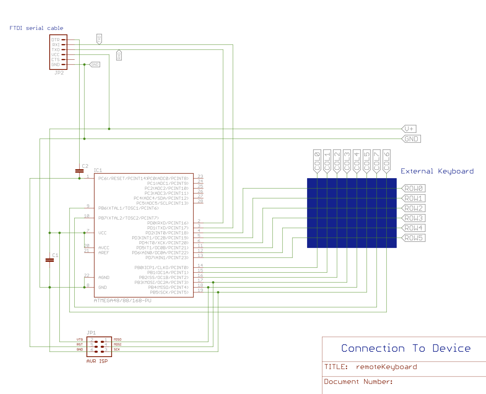

RemoteKeyboard: Control Anything!
=================================

This is a program that lets you monitor and control almost any device that has a matrix-scanned keyboard or keypad.

It talks over a serial port (right now; USB and I2C are planned), and:

- Reports what keys have been pressed and released.
    These are shown like **p23** for "press row 2 / column 3"
- accepts commands to fake pressing or releasing keys.
    These commands look like the key reports.

It can potentially use all of the IO lines of your AVR for some combination of:

- row sense (outputs)
- column strobe (inputs)

Here's a sample of how you might connect an ATMega168 (the processor in some [Arduino][] boards) to a 6x8 keyboard
(note that this will be broken when viewed on github):

[Arduino]: http://www.arduino.cc/
